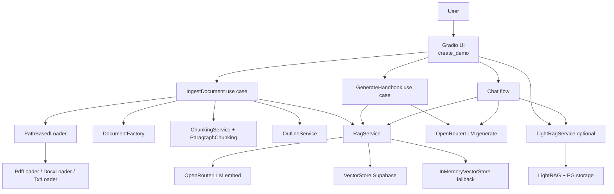
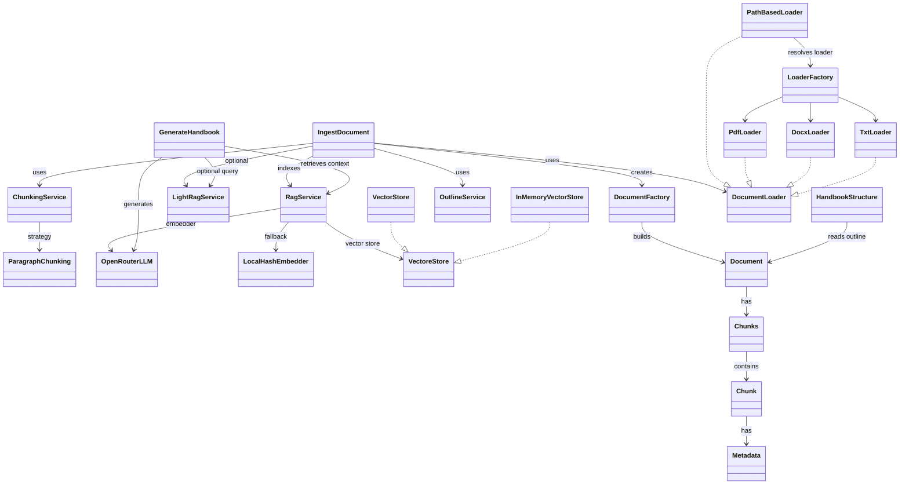

# Project Title
ChatApplication — Document Chat + Handbook Generator

## Description
A Gradio-based app that lets you upload PDF/DOCX/TXT documents, build a LightRAG knowledge base in Supabase, chat with an OpenRouter-backed LLM, and generate long-form handbooks with streaming output and stop control.

## Features
- Upload and process PDF, DOCX, and TXT files
- Chapter-aware chunking and indexing
- LightRAG + Supabase pgvector storage
- Streaming chat responses
- Streaming handbook generation with stop control
- UI safeguards to prevent concurrent heavy requests

## Architecture


## Class Dependency


## Installation
```bash
python -m venv .venv
source .venv/bin/activate
pip install -r requirements.txt
```

## Usage
1. Create `.env` from `.env.example` and fill in values.
2. Start the app:
```bash
python main.py
```
3. Upload documents in the **Document Upload** tab.
4. Use **Chat** to ask questions or **Handbook** to generate long-form output.

## Demo / Video
- [UI Overview](assets/video/ui_overview.mp4)
- [Handbook Structure Preview](assets/video/handbook_stucture_preview.mp4)
- [Handbook Generation](assets/video/handbook_generation.mp4)
- [Chat Processing](assets/video/chat_processing.mp4)
- [Full Demo](assets/video/full_demo.mp4)

## Full Demo

https://github.com/user-attachments/assets/df7f2212-4ad4-46e4-8e6c-081e4e712b66

## Configuration / Environment Variables
Create a `.env` file with your configuration. Use `cursor` markers below to replace values:
```env
OPENROUTER_API_KEY=<cursor>
LLM_API_URL=https://openrouter.ai/api/v1
OPENROUTER_CHAT_MODEL=z-ai/glm-4.5-air:free
OPENROUTER_EMBED_MODEL=text-embedding-3-small
OPENROUTER_EMBED_DIM=1536
REQUEST_TIMEOUT_SECONDS=60
RAG_TOP_K=6
RAG_MIN_SCORE=0.0
HANDBOOK_TARGET_WORDS=20000
HANDBOOK_SECTION_WORDS=1200
USE_LIGHTRAG=true
LIGHTRAG_WORKING_DIR=./lightrag_storage
LIGHTRAG_WORKSPACE=default_workspace
LIGHTRAG_QUERY_MODE=hybrid
LIGHTRAG_LOG_DIR=./lightrag_storage

SUPABASE_URL=https://<cursor>.supabase.co
SUPABASE_KEY=<cursor>
SUPABASE_DB_HOST=db.<cursor>.supabase.co
SUPABASE_DB_PORT=5432
SUPABASE_DB_USER=postgres
SUPABASE_DB_PASSWORD=<cursor>
SUPABASE_DB_NAME=postgres
SUPABASE_DB_MAX_CONNECTIONS=2
LIGHTRAG_MAX_ASYNC=2
LIGHTRAG_MAX_PARALLEL_INSERT=1
```